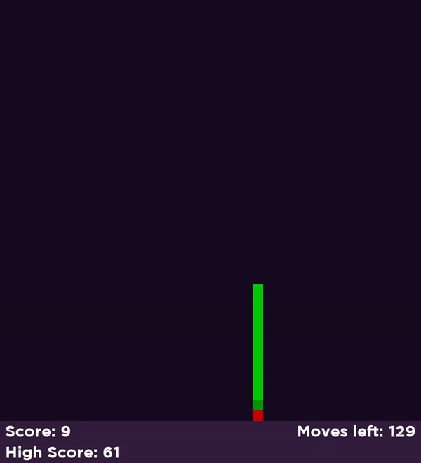

Snake
---
A simple Snake clone using the PyGame library.

The controls used are the keyboard arrows.

How to play
---
Install the PyGame library on your computer and execute the `main.py` file to run the game.